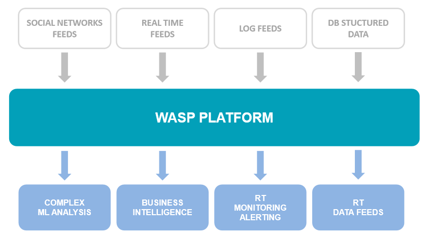

#### Architecture
You can refer to the diagrams below to gain a general overview of the architecture.
The project is divided into sub modules:

- **wasp-core**: provides all basic functionalities, pojo and utilities
- **wasp-master**: it provides the main entry point to control your application, exposing the WASP REST API. In the future, this will also provide a complete web application for monitoring and configuration.
- **wasp-producers**: a thin layer to easily expose endpoints for ingestion purposes. Leveraging Akka-Camel we can provide Http, Tcp, ActiveMQ, JMS, File and many other connectors. This ingestion layer pushes data into Kafka.
- **wasp-consumers-rt**: ...
- **wasp-consumers-spark**: the consumer layer incapsulates Spark Streaming to dequeue data from Kafka, apply business logic to it and then push the output on a target system.

All the components are coordinated, monitored and owned by an Akka Cluster layer, that provides scalability and fault tolerance for each component. For example you can spawn multiple identical producers to balance the load on your http endpoint, and then fairly distribute the data on Kafka.

---

---

