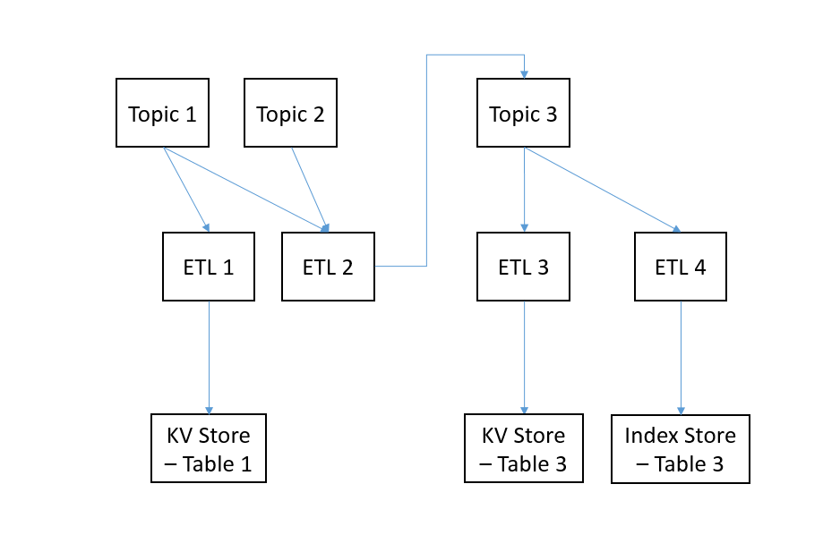

##### Extension points
In order to build your application there are several extension points where to place your algorithms.

- **Producer**: If your data can flow directly into Kafka, for example if you already have a Flume ingestion layer, you don't need to have producers. Otherwise you should extend WaspProducerActor, maybe leveraging Camel, to expose some kind of endpoint (tcp, http, jms, etc).  
At this point you only need to worry about formatting your incoming data according to an Avro schema, as the base class will handle the Kafka connectivity for you.
In order to have each producer acting independently, you should also overwrite WaspProducerNodeGuardian.

An example of an extended WaspProducerNodeGuardian:

```scala
final class YahooFinanceProducer(env: { val producerBL: ProducerBL; val topicBL: TopicBL })
    extends WaspProducerNodeGuardian(env) {

  val name = YahooFinanceProducer.name

  def startChildActors() = {
    logger.info(s"Starting child actors on ${cluster.selfAddress}")

    val stocks = producer.configuration
      .flatMap(bson => bson.getAs[BSONArray]("stocks").map(array => array.values.map(s => s.seeAsOpt[String].get)))
      .getOrElse(YahooFinanceProducer.stocks)

    stocks foreach { s =>
      println("stock: " + s)
      val aRef = context.actorOf(Props(new StockActor(s, kafka_router, associatedTopic)))
      aRef ! StartMainTask
    }
  }
}
```

An example of an extended WaspProducerActor:

```scala
case class Envelope(value: JsValue)
case object Tick

private[wasp] class StockActor(stock: String, kafka_router: ActorRef, topic: Option[TopicModel])
    extends ProducerActor[JsValue](kafka_router, topic) {

  import system.dispatcher
  val client = new HttpClient()
  val url =
    s"""https://query.yahooapis.com/v1/public/yql?q=select%20*%20from%20yahoo.finance.quotes%20where%20symbol%20in%20(%22$stock%22)&format=json&env=store%3A%2F%2Fdatatables.org%2Falltableswithkeys&callback="""

  override def preStart(): Unit = logger.info(s"Starting $stock")

  def mainTask(): Unit = {
    logger.info(s"Starting main task for actor: ${this.getClass.getName}")
    self ! Tick
  }

  override def receive: Receive = super.receive.orElse {
    case toSend: Envelope =>
      // actually send the message to Kafka
      sendMessage(toSend.value)
      // schedule the stock fetch in 10 seconds
      task = Some(context.system.scheduler.scheduleOnce(10.seconds, self, Tick))
    case Tick =>
      val jsonToSend = for {
        res        <- client.url(url).getStream()
        body       = res._2
        jsonString <- body |>>> Iteratee.fold("")((json, bytes) => json + new String(bytes, "UTF-8"))
        jsonValue  = JsonParser(jsonString)
        _          = logger.debug("Forwarding producer message to Kafka: " + jsonString)
      } yield Envelope(jsonValue)
      akka.pattern.pipe(jsonToSend).pipeTo(self)
    case Status.Failure(f) =>
      // if the http request failed, retry immediately
      logger.error(f.getMessage, f)
      self ! Tick
  }

  def generateOutputJsonMessage(inputJson: JsValue): String = {

    /* The following mappings are just an example made to show the producer in action */
    val id_event    = (inputJson \\ "count").map(_.as[Double]).headOption
    val source_name = (inputJson \\ "StockExchange").map(t => t.asOpt[String].getOrElse("")).headOption.getOrElse("")
    val topic_name  = topic.map(_.name).getOrElse(YahooTopicModel.yahooTopic.name)
    val metric_name = stock

    val ts = (inputJson \\ "created")
      .map(time =>
        time.asOpt[String] match {
          case None    => TimeFormatter.format(new Date())
          case Some(t) => TimeFormatter.format(t, YahooFinanceProducer.timeFormat)
        }
      )
      .head
    val latitude   = 0
    val longitude  = 0
    val value      = (inputJson \\ "Bid").map(t => t.asOpt[String].map(_.toDouble).getOrElse(0.0)).headOption.getOrElse(0.0)
    val bid        = value
    val ask        = (inputJson \\ "Ask").map(t => t.asOpt[String].map(_.toDouble).getOrElse(0.0)).headOption.getOrElse(0.0)
    val stock_name = (inputJson \\ "Name").map(t => t.asOpt[String].getOrElse(stock)).headOption.getOrElse(stock)
    val percent_change = (inputJson \\ "PercentChange")
      .map(t => t.asOpt[String].map(s => s.replace("%", "").toDouble).getOrElse(0.0))
      .headOption
      .getOrElse(0.0)
    val volume =
      (inputJson \\ "Volume").map(t => t.asOpt[String].map(_.toDouble).getOrElse(0.0)).headOption.getOrElse(0.0)
    val currency = (inputJson \\ "Currency").map(t => t.asOpt[String].getOrElse("")).headOption.getOrElse("")
    val payload  = inputJson.toString().replaceAll("\"", "") // String bonification

    val myJson = s"""{
		     "id_event":${id_event.getOrElse("0")},
		     "source_name":"$source_name",
		     "topic_name":"$topic_name",
		     "metric_name":"$metric_name",
		     "timestamp":"$ts",
		     "latitude":$latitude,
		     "longitude":$longitude,
		     "value":$value,
		     "payload":"$payload",
		     "stock_name":"$stock_name",
		     "bid":$bid,
		     "ask":$ask,
		     "percent_change":$percent_change,
		     "volume":$volume,
		     "currency":"$currency"
		     }"""

    myJson
  }
}
```

- **Consumer**: to create a consumer you only need to implement the Strategy trait with a concrete class. The fully qualified name of the class will then be used in the ETL block inside the Pipegraph definition or in the Batch definition.

- **Models**: these define all the details of your Pipegraph, such as the Inputs, ETL blocks and Outputs, along with some metadata. Topics, Index, Raw etc. are first defined separately using the corresponding model classes, and then are used inside the Pipegraph definition. This has to be added to Wasp DB; a convenient place to do this in is the launch() method in the MasterNodeLauncher trait. Simply extend the trait in a class, implement the method, then use your Launcher as the main class for your application.

- **Pipegraph**:

    The following diagram represents a pipegraph overview diagram:

    

    while this is a more specific model representation of it:

    

    The pipegraph is the core of WASP, because it allows to abstract a pipeline with no coupling between components. It's really easy to change a pipegraph in order to add a datastore or more transformation steps.
    The structure of a Pipegraph forces you to implement in the right direction to avoid architectural mistakes. It forces you to have just one single output for each stream, so if you need to write your data into two datastore you are forced to redirect the stream to Kafka topic and to consume it with two indipendent consumers.

    An example of a Pipegraph definition:

```scala
object MetroPipegraphModel {

  lazy val metroPipegraphName      = "MetroPipegraph6"
  lazy val metroPipegraph          = MetroPipegraph()
  lazy val conf: Config            = ConfigFactory.load
  lazy val defaultDataStoreIndexed = conf.getString("default.datastore.indexed")

  private[wasp] object MetroPipegraph {

    def apply() =
      PipegraphModel(
        name = MetroPipegraphModel.metroPipegraphName,
        description = "Los Angeles Metro Pipegraph",
        owner = "user",
        system = false,
        creationTime = WaspSystem.now,
        etl = List(
          ETLModel(
            "write on index",
            List(
              ReaderModel(MetroTopicModel.metroTopic._id.get, MetroTopicModel.metroTopic.name, TopicModel.readerType)
            ),
            WriterModel.IndexWriter(
              MetroIndexModel.metroIndex._id.get,
              MetroIndexModel.metroIndex.name,
              defaultDataStoreIndexed
            ),
            List(),
            Some(StrategyModel("it.agilelab.bigdata.wasp.pipegraph.metro.strategies.MetroStrategy", None))
          )
        ),
        rt = List(),
        dashboard = None,
        isActive = false,
        _id = Some(BSONObjectID.generate)
      )
  }
}
```

Another important part of the pipegraph is the strategy. Using strategy, you can apply custom transformation directly to the dataframe, when the DStream is processed with Spark.

An example of a Pipegraph strategy definition:

```scala
case class MetroStrategy() extends Strategy {

  def transform(dataFrames: Map[ReaderKey, DataFrame]) = {

    val input = dataFrames.get(ReaderKey(TopicModel.readerType, "metro.topic")).get

    /** Put your transformation here. */
    input.filter(input("longitude") < -118.451683d)
  }
}
```

In this example the DataFrame is filtered at runtime with a "longitude" condition (i.e. < -118.451683D). Is possible apply more complicated trasformations using all the Spark DataFrame APIs like select, filter, groupBy and count [Spark DataFrame APIs](https://spark.apache.org/docs/1.6.2/api/scala/index.html#org.apache.spark.sql.DataFrame).

#### Have a look at what's going on
- <http://localhost:2891/pipegraphs>, <http://localhost:2891/producers>, <http://localhost:2891/batchjobs> for the current state of your Pipegraphs / Producers / BatchJobs
- <http://localhost:8088> YARN Web UI